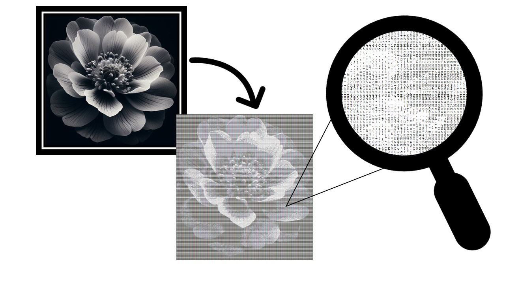

# ASCII Art Shell

This project implements an ASCII art shell, which allows users to generate ASCII representations of images using a set of ASCII characters. The shell provides various commands for manipulating the image, adjusting resolution, adding or removing ASCII characters, and changing output methods.

## Usage

To run the ASCII art shell, simply execute the `Shell` class. The shell will continuously prompt for user input until the user enters "exit".

## Commands

The following commands are available in the ASCII art shell:

- `chars`: Prints the currently used ASCII characters.
- `add <characters>`: Adds ASCII characters to the character set. `<characters>` can be individual characters, character ranges (e.g., 'A-Z'), or special cases ('all' or 'space').
- `remove <characters>`: Removes ASCII characters from the character set. Supports the same syntax as the `add` command.
- `res <up/down>`: Increases or decreases the resolution for ASCII art generation.
- `image <path>`: Sets a new image for ASCII art generation. `<path>` specifies the path to the image file.
- `output <method>`: Changes the output method for displaying ASCII art. Available methods are 'console' and 'html'.
- `asciiArt`: Executes the ASCII art generation algorithm and displays the result.

## Exceptions

The shell handles the following exceptions:

- `InvalidArgumentException`: Raised when an invalid argument is provided for a command.
- `ExceedingBoundariesException`: Raised when attempting to exceed resolution boundaries.
- `InvalidImageArgumentException`: Raised when there is a problem loading the image file.
- `EmptyCharSetException`: Raised when the ASCII character set is empty.
- `InvalidCommandException`: Raised when an invalid command is entered.

## Default Configuration

By default, the ASCII art shell uses a sample image `flower.jpg` as the input for ASCII art generation. The ASCII art is displayed in the console using the default output method.

You can change the output method to display ASCII art in HTML format by using the `output` command followed by the argument `html`. For example:

## Authors

### Ariel Pinhas
- [GitHub](https://github.com/ariel-pi)
- [Linkdin](http://www.linkedin.com/in/ariel-pinhas)

### AmielWre
- [GitHub](https://github.com/amielwre)
